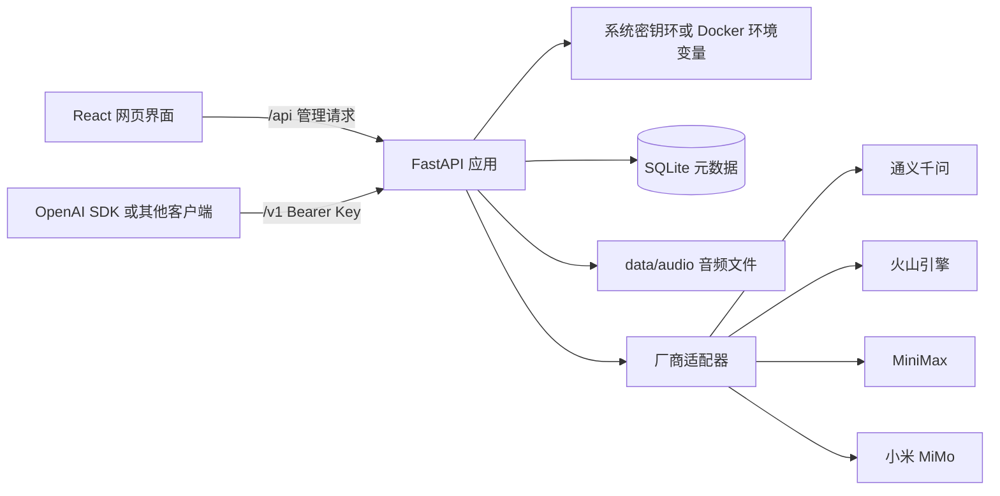
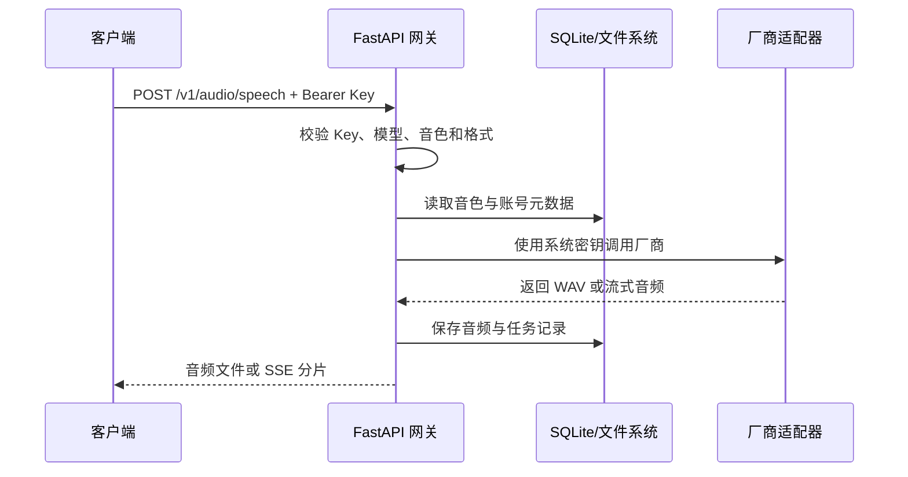

# 架构说明

Voice Studio 是单机优先的 React + FastAPI 应用。浏览器只访问本机后端，厂商密钥不会进入前端代码，也不会由浏览器直接发送到厂商。

## 目录职责

| 目录或文件 | 职责 |
| --- | --- |
| `frontend/src/App.tsx` | 页面状态、表单交互、音色库、任务历史和网关控制台 |
| `frontend/src/styles.css` | 全局布局、组件样式、响应式和无障碍焦点样式 |
| `backend/app/main.py` | FastAPI 路由、请求校验、网关鉴权、任务记录和静态文件服务 |
| `backend/app/providers/` | 各厂商 TTS、流式、克隆和设计能力的适配器 |
| `backend/app/credentials.py` | 系统密钥环和 Docker 环境变量凭据读取/保存 |
| `backend/app/storage.py` | 存储策略、容量统计和自动清理计划 |
| `data/voice_studio.db` | 任务、音色、厂商账号元数据；不保存完整 API Key |
| `data/audio/` | 生成音频、参考音频和设计试听文件 |

## 一次合成请求

流式接口会优先使用厂商原生流式能力；不支持原生流式的模型由后端完成兼容转换。每次网关请求都会记录状态、延迟、模型和错误代码，但不会记录厂商密钥。

## 凭据与安全边界

- Windows 使用 Windows Credential Manager，macOS 使用 Keychain，Linux 使用 Secret Service/KWallet。
- Docker 使用 `.env` 或部署平台 Secret，并以只读文件系统、非 root 用户、丢弃 Linux capabilities 和 `no-new-privileges` 运行。
- `/v1/*` 接口必须携带 Gateway Key；默认服务地址只监听 `127.0.0.1`。
- 自定义厂商 Endpoint 默认只允许官方域名；启用自定义 Endpoint 时应确保目标可信，否则厂商 Key 可能被发送到错误服务。
- 音频路径在读取、下载和清理前都会校验其位于 `data/audio` 目录内。

## 存储生命周期

任务元数据保存在 SQLite，音频单独保存在 `data/audio`。存储策略可以按保留天数和容量上限生成清理计划；默认只清理音频，任务文字记录继续保留。选择“任务记录”范围时，相关任务和音频会一起删除。

## 扩展厂商

新增厂商通常需要：

1. 在 `backend/app/providers/` 增加实现 `base.py` 约定的适配器。
2. 在 `main.py` 注册默认 Endpoint、模型列表和能力标记。
3. 为同步、克隆、设计或流式能力补充对应测试。
4. 在前端模型选择和设置页面补充显示信息。

适配器应将厂商错误转换为 `ProviderError`，避免把密钥、完整上游响应或内部路径写入用户可见错误。
